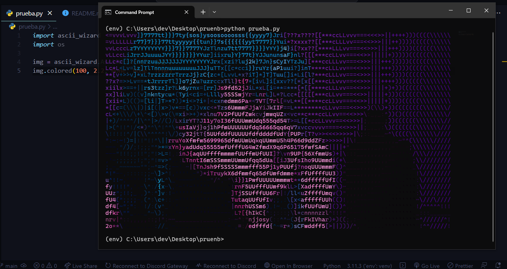

<!-- Improved compatibility of back to top link: See: https://github.com/othneildrew/Best-README-Template/pull/73 -->
<a name="readme-top"></a>


<!-- GETTING STARTED -->
## Getting Started

This is an example of how you may give instructions on setting up your project locally.
To get a local copy up and running follow these simple example steps.

### Prerequisites

This is an example of how to list things you need to use the software and how to install them.
* pip
  ```sh
  pip install ascii-wizard
  ```

### Installation

_Below is an example of how you can instruct your audience on installing and setting up your app. This template doesn't rely on any external dependencies or services._

1. first clone the repository
    ```sh
    git clone https://github.com/Sherklan12e/Ascii-wizard
    ```
2. create a virtual environment
3. Activate the environment

   
3. Install requeriments
   ```sh
   pip install -r requirements.txt
   ```
4. run
   ```sh
   python prueba.py
   ```
4. linux :
   ```sh
    python3 prueba.py
   ```



## Usage

 the [Documentation](https://github.com/IceWizard4902/ascii_wizard)_


<!-- CONTACT -->
## Contact

Social media- [instagram](https://www.instagram.com/davis_patrick_men/) - davismendoza.08@gmail.com


<p align="right">(<a href="#readme-top">back to top</a>)</p>


